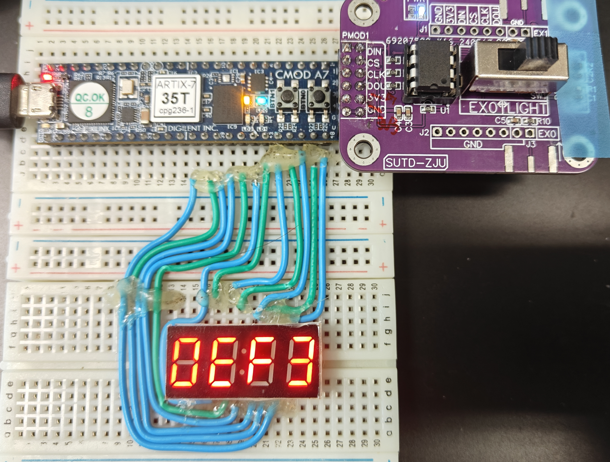

# CMODA7_Demo_MCP3202_SPI_UART-TX_Verilog

This project demonstrates the use of an FPGA for SPI-based ADC data acquisition and UART transmission using the CMOD A7 development board. The design utilizes an MCP3202 dual-channel ADC along with a Verilog-based MCP3202 driver. Additionally, the captured analog voltage is transmitted to a PC via UART-Tx.

The demo is designed to help you learn:

1. Analog-to-Digital Converters (ADC)
2. SPI Communication Protocols (Master/Slave, Synchronous Communication)
3. UART Communication Protocols (Baud Rate, Asynchronous Communication)
4. Task Scheduling in FPGA Designs

## Getting Started

### MCP3202 Protocol Detail:

* Inputs:

  1. - rstn: Active low reset signal.
  2. - clk: Clock signal.
  3. - ap_ready: Signal indicating the host is ready for data processing.
  4. - mode: 2-bit input to select the ADC channel and configuration.
  5. - port_din: Serial data input from the ADC.

* Outputs:

  1. - ap_vaild: Signal that indicates valid data is available.
  2. - data: 12-bit output holding the ADC conversion result.
  3. - port_dout: Serial data output to the ADC.
  4. - port_clk: Clock signal for the ADC.
  5. - port_cs: Chip select signal for the ADC, active low.

#### MCP3202 Operation Mode

* SINGLE_CHAN0  = 2'b10; - CHANNEL 0;
* SINGLE_CHAN1  = 2'b11; - CHANNEL 1;
* DIFFER_CHAN01 = 2'b00;  - DIFFERENTIAL CHANNEL 01
* DIFFER_CHAN10 = 2'b01;  - DIFFERENTIAL CHANNEL 10

#### MCP3202 Extension Board

Plese refer to [Schematic_M2_Temp_Light_Sensor](./Figure/Schematic_M2_Temp_Light_Sensor.pdf) in the schematic;
The extension board features two built-in sensors:

* Light Sensor (Channel 0)
*  Temperature Sensor (Channel 1)

A switch allows you to select between sampling the built-in signals or an external signal.

### UART Protocol Detail

* Inputs:

  1. clk : Clock Signal (In this demo, since Baudrate is 9600, the clock frequency should also be 9600Hz);
  2. ap_rstn : async reset;
  3. ap_ready : Signal indicating the host is ready for data processing.
  4. pairty : 1'b1 - Enable Pairty Bit   1'b0 - Disable Pairty Bit
  5. data : The Byte (8 bits) to be transmitted;

* Outputs

  1. ap_vaild :  Indicates that the transmission is complete.
  2. tx :  Serial output for data transmission;

## Prerequisites

* Vivado 2024.2 (Updated, Previous 2023.1);
* CMOD A7-35T Board File;

## MCP3202 Simulation Result
The following figure is the simulation result of MCP3202 SPI protocol.

## MCP3202 Real Test
The following figures are the real test for CMOD A7 with MCP3202 ADC, which read CH0 analog input and display on the 7 segment display; The leftmost digit is only used for indication, which always display "0"; Since the MCP3202 is 12 bits ADC, it can be shown in Hex format with 3 digits;

1. Light Sensor (Normal Operation and UART Transmission):

1. Light Sensor (Covered Sensor):

## Reference

MCP3202 Dataset:
https://www.farnell.com/datasheets/1669376.pdf

CMOD A7 Reference Page:
https://digilent.com/reference/programmable-logic/cmod-a7/start
 
## License
This project is licensed under the MIT License;
